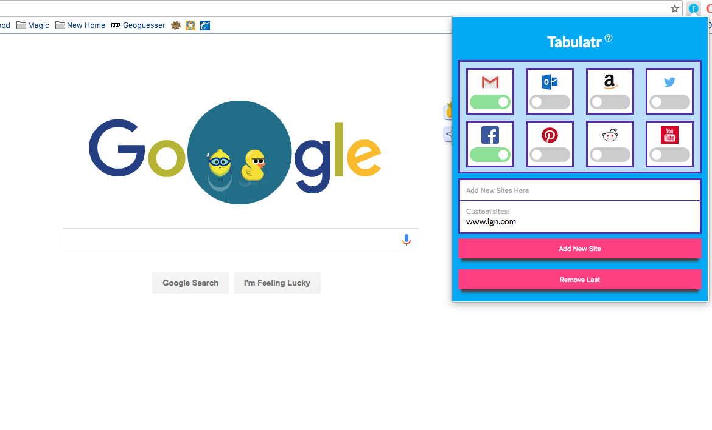

# Tabulatr...

## Premise:

Prevent accidentally accumulating multiple "zombie" instances of websites you only ever need one instance of open at a time. This will be different for everyone - for me it's things like Facebook, gmail etc.

## How to install:

Download the repo and unzip. Open chrome's extensions panel, click "Developer mode" and then "Load unpacked extension" and point to the folder you just unzipped. That's it!

## How to use:

Tabulatr comes pre-loaded with a few sites, each of which has a cool little logo and a toggle switch. Toggle-on any sites you know you don't need to have more than one open at a time and/or add any additional sites you'd like in the input box, and watch Tabulatr work its magic. For the moment you'll want to manually close any duplicate tabs you might have had open before running Tabulatr for the first time - this will become automated in a future patch.

## Bugs:

If you find any bugs, please(!) report it <a href="https://github.com/llanginger/no-tab/issues">here</a>!
Also, if you feel like I have left out any obvious sites from the pre-packaged list, please suggest them <a href="https://github.com/llanginger/no-tab/issues/1">here</a>!
